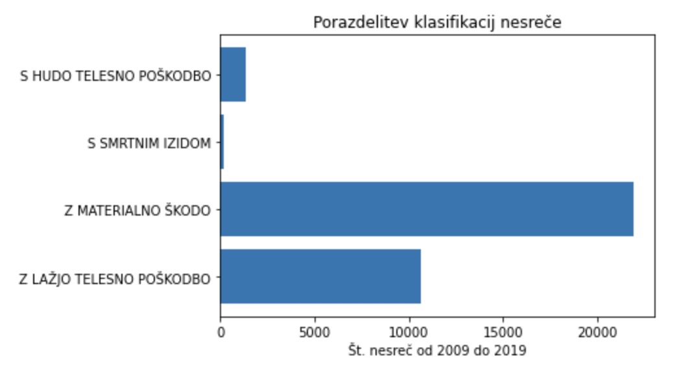
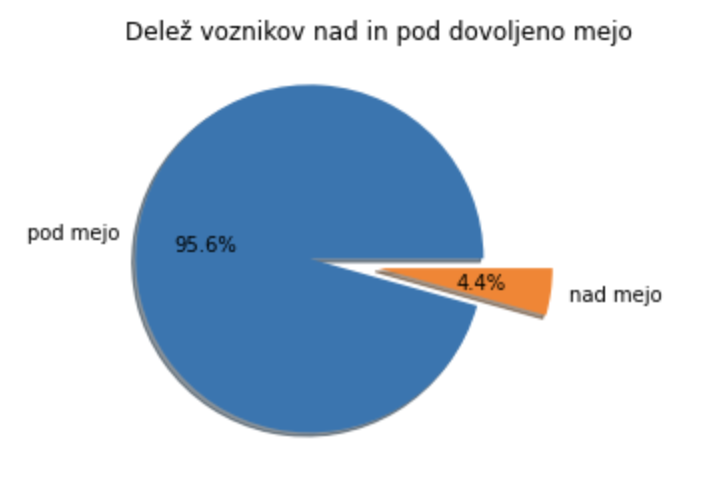
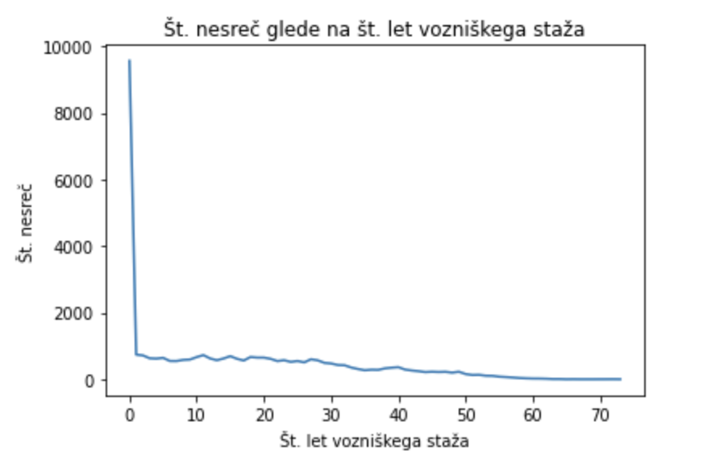

# Analiza vzrokov prometnih nesreč v Sloveniji
S to analizo sva želela pokazati glavne razloge/faktorje za prometne nesreče v Sloveniji.
## Člana
* Nermin Mujagić
* Jaša Jovan

## Opis podatkov
Za projektno nalogo sva zbrala podatke na spletni strani podatki.gov.si, kjer sva vzela [podatke o prometnih nesrečah od leta 2009 pa do leta 2019](https://podatki.gov.si/dataset/mnzpprometne-nesrece-od-leta-2009-dalje). Datoteke so med seboj ločene po letih.

## Cilji
- starost udeleženca / vozniški staž
- delež alkohola v krvi
- večkratna udeleženost iste osebe

## Rezultati

Največ izidov nesreč je le z materialno škodo, kar je tudi pričakovano, saj je manjša verjetnost poškodbe pri nesrečah, kot je le škoda na avtomobilu ali okolici. Najmanj je srmtnih izidov.

Najbolj zanimiv podatek za naju je bil, da je le 4.4% voznikov imelo prekomerno vsebino alkohola pri alkotestu (vpihu). Pričakovala sva, da bo to večji delež. Verjetno se bo izkazalo, da bo korelacija precej močna.

Zelo očitno da je največ nesreč pri vozniškemu stažu do 1 leta. Trend je takšen, da z več leti staža, manjša se št. nesreč. Vredno je tudi omeniti, da seveda ker so podatki od 2009 - 2019, je seveda največ zabeleženo o tistih, ki imajo 10 let staž ali manj.
